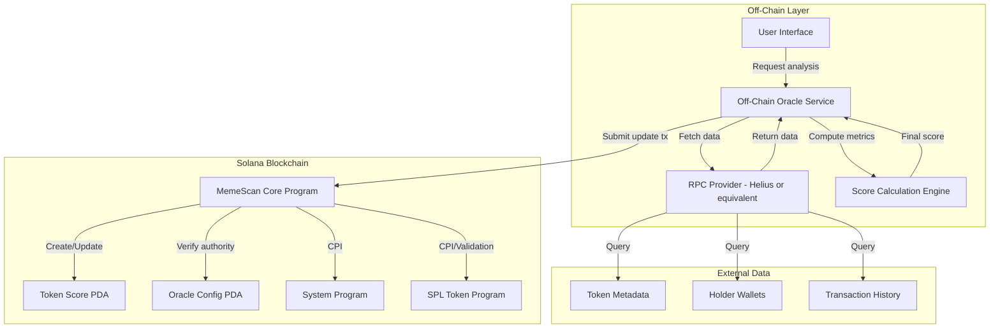
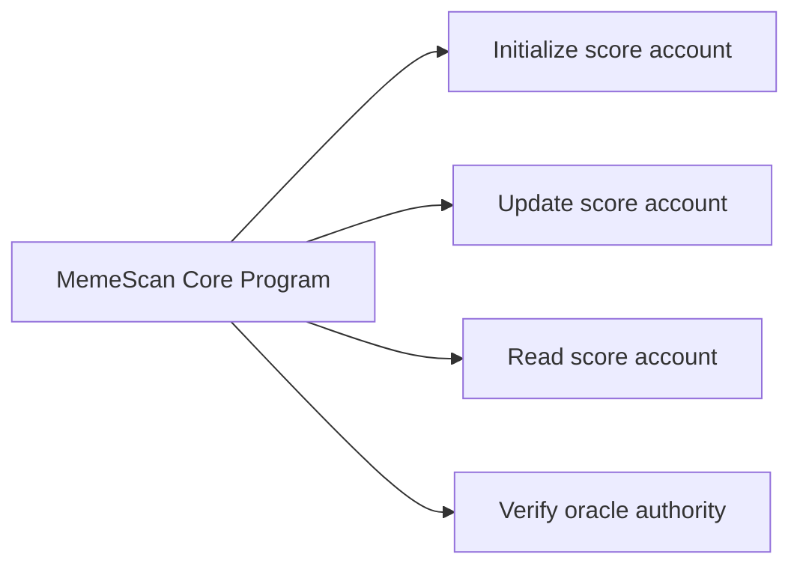
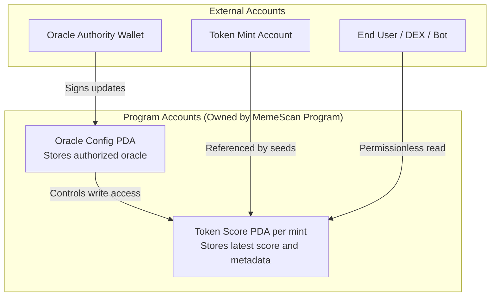
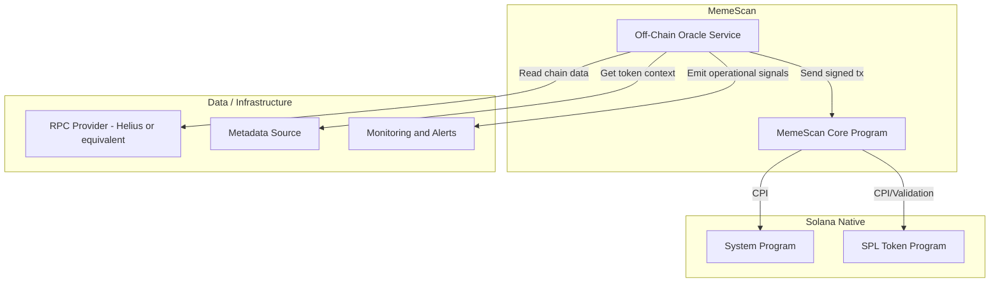
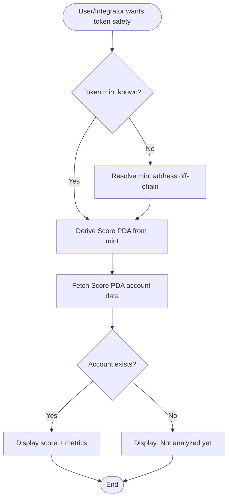
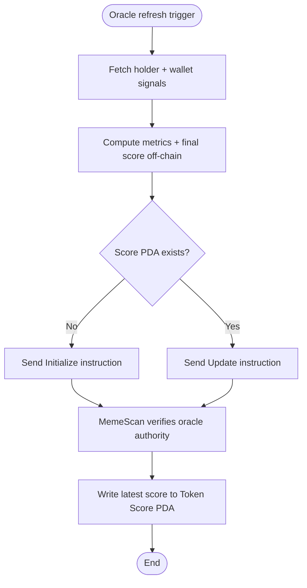
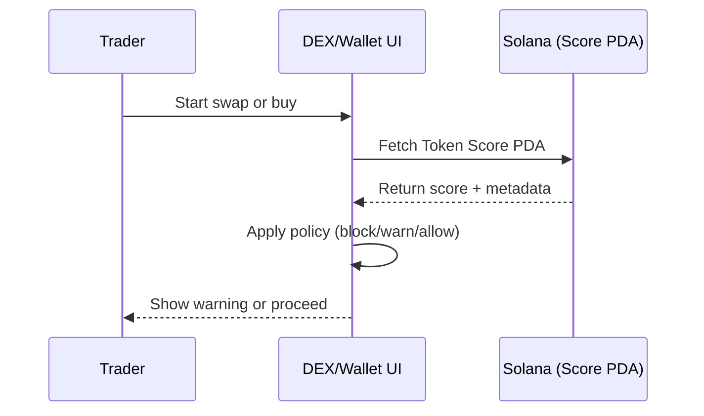
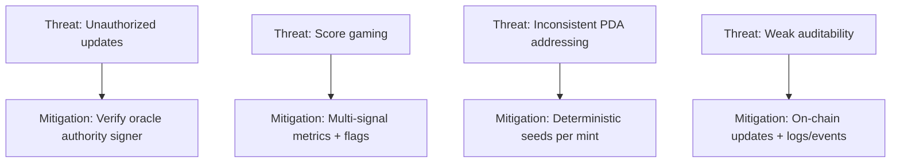

# MemeScan Verifier — Solana Protocol Architecture

**Project:** MemeScan Verifier  
**Team:** Ramkumar Kushwah & Shivani  
**Date:** February 7, 2026

## Overview
MemeScan Verifier computes a token trust score off-chain and stores the latest result on-chain in a deterministic PDA per mint. This provides fast analytics with immutable, composable on-chain state that wallets, DEX UIs, and bots can read permissionlessly.

## 1. Program Structure Visualization
### Objective
Represent the protocol as a minimal on-chain core + off-chain oracle pipeline:
- On-chain program verifies oracle authority and updates score state.
- Off-chain oracle fetches data, computes multi-signal metrics, and submits signed updates.
- Integrators read score PDAs to make risk decisions.

### High-Level Architecture

### Core Program Responsibilities

## 2. Account Structure Mapping
### Account Model

### PDA Derivation Concept
- `Oracle Config PDA`: deterministic config address for oracle authority policy.
- `Token Score PDA`: deterministic per-mint address, derived from fixed seed(s) + token mint.
- Result: third-party apps can derive the exact score account for any mint without an indexer.

## 3. External Dependencies and Integrations

## 4. Detailed Flowcharting
### A) Token Score Lookup (Read Path)

### B) Oracle Score Submission (Write Path)

### C) DEX/Wallet Decision Sequence

## 5. Security, Threats, and Mitigations

### Security Notes
- Write access is restricted to the configured oracle authority.
- Read access is permissionless for all clients.
- Deterministic PDA derivation reduces integration ambiguity.
- On-chain state provides auditability of the latest published score.

## 6. Program Interaction Matrix
| From | To | Type | Purpose |
|---|---|---|---|
| Oracle Service | MemeScan Core Program | Transaction | Initialize/update score |
| MemeScan Core Program | Oracle Config PDA | Read/Verify | Authorize writer |
| MemeScan Core Program | Token Score PDA | Write | Persist latest score |
| MemeScan Core Program | System Program | CPI | Account creation/rent ops |
| MemeScan Core Program | SPL Token Program | CPI/Read | Token-related checks |
| DEX/Wallet/Bot | Token Score PDA | Read | Risk-aware UX/policy |

## 7. Legend (Diagram Conventions)
- **Program box:** on-chain execution boundary.
- **PDA/account box:** on-chain state container.
- **External service shape/group:** off-chain data or infrastructure.
- **Arrow labels:** action semantics such as `Read`, `Update`, `CPI`, `Verify`, `Query`.

## 8. Solana-Specific Design Notes
- **Modularity:** off-chain analytics separated from on-chain state anchoring.
- **Separation of concerns:** oracle computes; program verifies and stores.
- **Composability:** any protocol can read score PDAs directly.
- **Determinism:** PDA-per-mint pattern supports predictable integrations.

## 9. Common Pitfalls and How This Design Avoids Them
- Overcrowded diagrams: split into overview, accounts, and flows.
- Weak labels: all arrows explicitly annotate intent.
- Missing decisions: read/write flows include branch conditions.
- Account ambiguity: PDA purpose and ownership are explicit.

## 10. Evaluation Checklist Mapping
- All programs represented: Yes.
- Account structures mapped: Yes (Oracle Config PDA, Token Score PDA, mint, authority).
- Program interactions illustrated: Yes (including CPI paths).
- External dependencies shown: Yes (RPC, metadata, monitoring).
- Decision points and alternate flows included: Yes.
- Clear, consistent labeling: Yes.

---

### Suggested Tooling
This document uses Mermaid-compatible syntax and can be rendered in Markdown viewers that support Mermaid. Equivalent versions can be recreated in Draw.io, Lucidchart, Figma, or PlantUML if your evaluator requires static exports.
