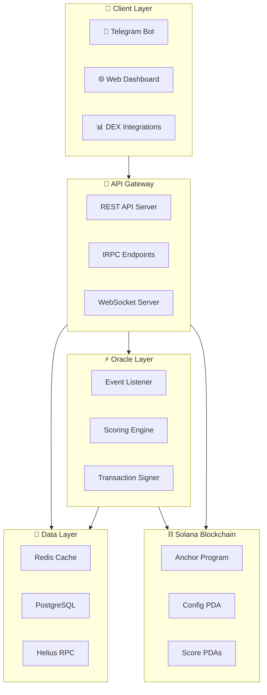
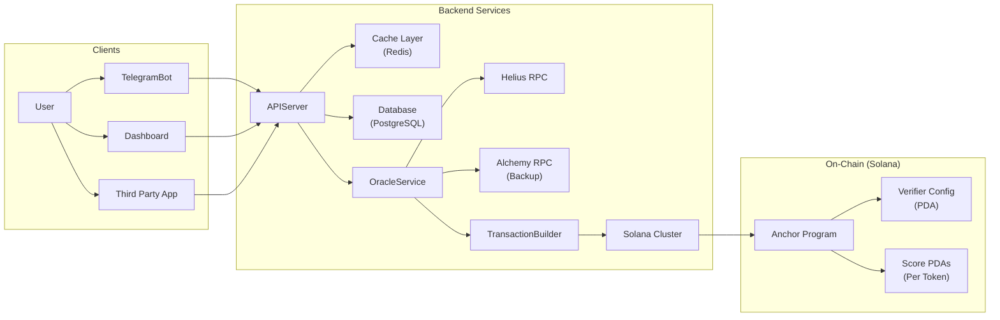
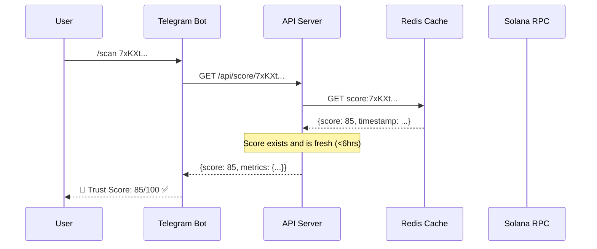
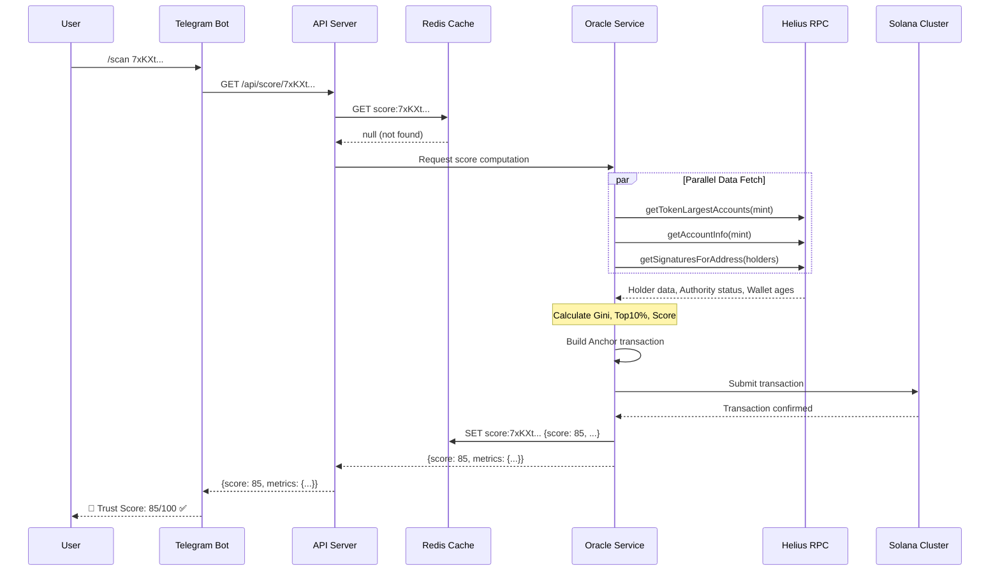
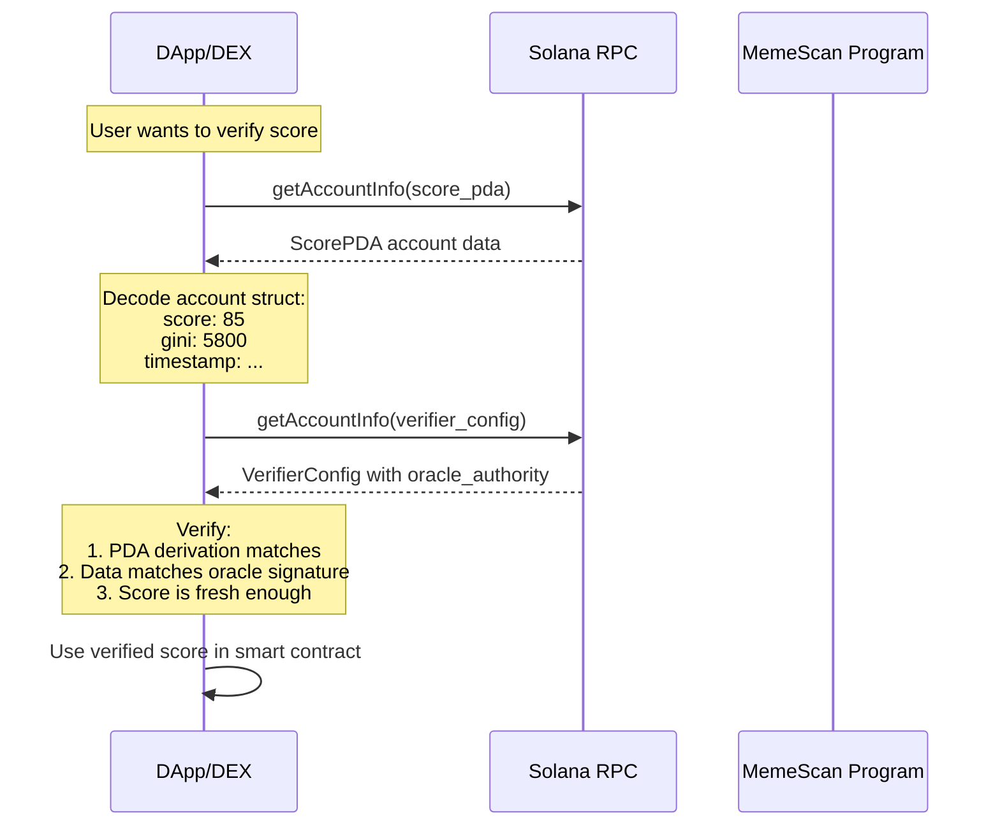
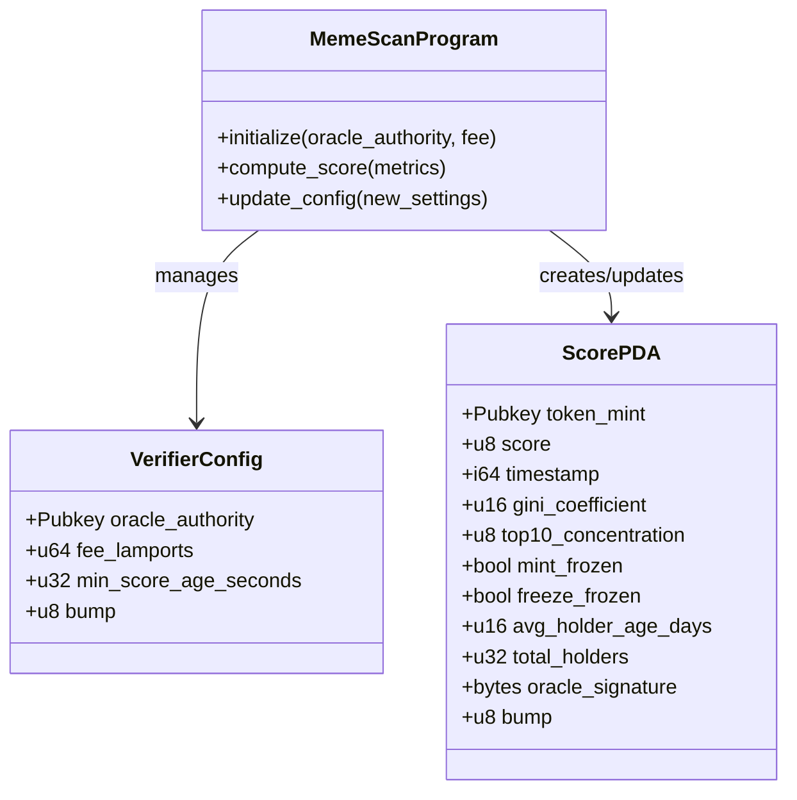
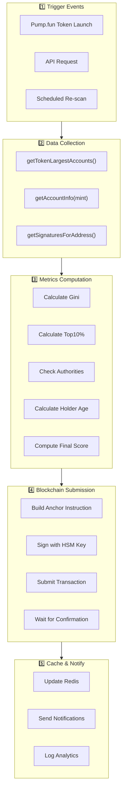
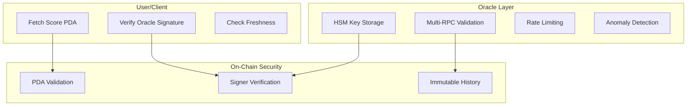

# MemeScan Architecture & System Design

---

## Table of Contents
1. [System Overview](#system-overview)
2. [Component Architecture](#component-architecture)
3. [Data Flow Diagrams](#data-flow-diagrams)
4. [On-Chain Program Design](#on-chain-program-design)
5. [Oracle Pipeline](#oracle-pipeline)
6. [File Structure](#file-structure)
7. [API Design](#api-design)
8. [Security Architecture](#security-architecture)

---

## System Overview

### High-Level Architecture



### What Each Layer Does

| Layer | Purpose | Components |
|-------|---------|------------|
| **Client** | User interfaces | Telegram Bot, Web Dashboard, DEX APIs |
| **API Gateway** | Request handling | REST API, tRPC, WebSockets |
| **Oracle** | Score computation | Event listener, Scorer, Signer |
| **Data** | Storage & caching | Redis, PostgreSQL, RPC nodes |
| **Blockchain** | Immutable storage | Anchor program, PDAs |

---

## Component Architecture

### Detailed Component View



### Component Responsibilities

#### 1. Telegram Bot
```
┌─────────────────────────────────────────────────────────────────┐
│  TELEGRAM BOT                                                   │
├─────────────────────────────────────────────────────────────────┤
│  Purpose: User-friendly interface for quick token scans        │
│                                                                  │
│  Commands:                                                       │
│  ├─ /scan <mint_address>  → Get trust score                    │
│  ├─ /watch <mint_address> → Set up alerts                      │
│  ├─ /portfolio            → View watched tokens                 │
│  └─ /help                 → Show available commands             │
│                                                                  │
│  Response Format:                                                │
│  ┌────────────────────────────────────────┐                     │
│  │ 🎯 MemeScan Trust Score: 85/100       │                     │
│  │ ✅ SAFE TO BUY                         │                     │
│  │                                        │                     │
│  │ 📊 Distribution: Good (Gini: 0.58)    │                     │
│  │ 🐋 Top 10 holders: 42%                │                     │
│  │ 🔒 Authorities: Frozen ✓              │                     │
│  │ ⏰ Avg holder age: 18 days            │                     │
│  │                                        │                     │
│  │ 🔗 Verified on-chain: slot 284937261  │                     │
│  └────────────────────────────────────────┘                     │
└─────────────────────────────────────────────────────────────────┘
```

#### 2. API Server
```
┌─────────────────────────────────────────────────────────────────┐
│  API SERVER (Express + tRPC)                                    │
├─────────────────────────────────────────────────────────────────┤
│  Purpose: Central gateway for all client requests               │
│                                                                  │
│  Endpoints:                                                      │
│  ├─ GET  /api/score/:mint      → Get cached score              │
│  ├─ POST /api/verify/:mint     → Request new computation       │
│  ├─ GET  /api/history/:mint    → Historical scores             │
│  ├─ GET  /api/trending         → Top scanned tokens            │
│  └─ WS   /ws/scores            → Real-time score updates       │
│                                                                  │
│  Middleware:                                                     │
│  ├─ Rate limiting (by API key / IP)                            │
│  ├─ Authentication (for premium endpoints)                      │
│  ├─ Request validation (Zod schemas)                            │
│  └─ Error handling & logging                                    │
└─────────────────────────────────────────────────────────────────┘
```

#### 3. Oracle Service
```
┌─────────────────────────────────────────────────────────────────┐
│  ORACLE SERVICE                                                 │
├─────────────────────────────────────────────────────────────────┤
│  Purpose: Compute scores and submit to blockchain              │
│                                                                  │
│  Components:                                                     │
│  ├─ Event Listener                                              │
│  │   ├─ Listens to Pump.fun token launches                     │
│  │   ├─ Listens to API requests                                │
│  │   └─ Scheduled re-scans (every 6 hours)                     │
│  │                                                              │
│  ├─ Scoring Engine                                              │
│  │   ├─ Fetches holder data from RPC                           │
│  │   ├─ Calculates Gini coefficient                            │
│  │   ├─ Checks authority status                                │
│  │   └─ Computes final weighted score                          │
│  │                                                              │
│  └─ Transaction Signer                                          │
│       ├─ Builds Anchor instruction                             │
│       ├─ Signs with HSM-backed key                             │
│       └─ Submits to Solana cluster                             │
└─────────────────────────────────────────────────────────────────┘
```

---

## Data Flow Diagrams

### Flow 1: User Requests Token Score (Cache Hit)



### Flow 2: User Requests Token Score (Cache Miss)



### Flow 3: Score Verification by Third Party



---

## On-Chain Program Design

### Program Structure



### PDA (Program Derived Address) Structure

```
PDA DERIVATION:
┌─────────────────────────────────────────────────────────────────┐
│                                                                  │
│  VERIFIER CONFIG PDA                                            │
│  ────────────────────                                            │
│  Seeds: ["config"]                                               │
│  Purpose: Global configuration (one per program)                 │
│                                                                  │
│  Derivation:                                                     │
│  PDA = findProgramAddress(                                       │
│    [Buffer.from("config")],                                      │
│    PROGRAM_ID                                                    │
│  )                                                               │
│                                                                  │
│  ═══════════════════════════════════════════════════════════    │
│                                                                  │
│  SCORE PDA (per token)                                          │
│  ─────────────────────                                           │
│  Seeds: ["score", token_mint]                                   │
│  Purpose: Store trust score for specific token                   │
│                                                                  │
│  Derivation:                                                     │
│  PDA = findProgramAddress(                                       │
│    [Buffer.from("score"), tokenMint.toBuffer()],                │
│    PROGRAM_ID                                                    │
│  )                                                               │
│                                                                  │
│  Example:                                                        │
│  Token: 7xKXtQGH4e2S3R6qVWZzF...                                │
│  Score PDA: 9aB2kLP8jM5R2NqZ3W...                               │
└─────────────────────────────────────────────────────────────────┘
```

### Account Data Layout

```
ACCOUNT DATA STRUCTURES:
┌─────────────────────────────────────────────────────────────────┐
│                                                                  │
│  VERIFIER CONFIG (57 bytes total)                               │
│  ─────────────────────────────────                               │
│  ┌──────────────────────────────────────────────────────────┐  │
│  │ Offset │ Field                   │ Type    │ Size        │  │
│  ├────────┼─────────────────────────┼─────────┼─────────────┤  │
│  │ 0      │ (Discriminator)         │ [u8;8]  │ 8 bytes     │  │
│  │ 8      │ oracle_authority        │ Pubkey  │ 32 bytes    │  │
│  │ 40     │ fee_lamports            │ u64     │ 8 bytes     │  │
│  │ 48     │ min_score_age_seconds   │ u32     │ 4 bytes     │  │
│  │ 52     │ bump                    │ u8      │ 1 byte      │  │
│  │ 53     │ _padding                │ [u8;4]  │ 4 bytes     │  │
│  └──────────────────────────────────────────────────────────┘  │
│                                                                  │
│  ═══════════════════════════════════════════════════════════    │
│                                                                  │
│  SCORE PDA (158 bytes total)                                    │
│  ───────────────────────────                                     │
│  ┌──────────────────────────────────────────────────────────┐  │
│  │ Offset │ Field                   │ Type    │ Size        │  │
│  ├────────┼─────────────────────────┼─────────┼─────────────┤  │
│  │ 0      │ (Discriminator)         │ [u8;8]  │ 8 bytes     │  │
│  │ 8      │ token_mint              │ Pubkey  │ 32 bytes    │  │
│  │ 40     │ score                   │ u8      │ 1 byte      │  │
│  │ 41     │ timestamp               │ i64     │ 8 bytes     │  │
│  │ 49     │ gini_coefficient        │ u16     │ 2 bytes     │  │
│  │ 51     │ top10_concentration     │ u8      │ 1 byte      │  │
│  │ 52     │ mint_frozen             │ bool    │ 1 byte      │  │
│  │ 53     │ freeze_frozen           │ bool    │ 1 byte      │  │
│  │ 54     │ avg_holder_age_days     │ u16     │ 2 bytes     │  │
│  │ 56     │ total_holders           │ u32     │ 4 bytes     │  │
│  │ 60     │ oracle_signature        │ [u8;64] │ 64 bytes    │  │
│  │ 124    │ bump                    │ u8      │ 1 byte      │  │
│  │ 125    │ _padding                │ [u8;33] │ 33 bytes    │  │
│  └──────────────────────────────────────────────────────────┘  │
└─────────────────────────────────────────────────────────────────┘
```

---

## Oracle Pipeline

### Pipeline Flow



### Gini Calculation Algorithm (Code)

```javascript
/**
 * Calculate Gini coefficient from holder balances
 * @param {number[]} balances - Array of token balances
 * @returns {number} Gini coefficient (0-1)
 */
function calculateGini(balances) {
  // Step 1: Sort ascending
  const sorted = [...balances].sort((a, b) => a - b);
  const n = sorted.length;
  
  // Step 2: Calculate sum
  const totalSum = sorted.reduce((acc, val) => acc + val, 0);
  
  if (totalSum === 0 || n === 0) {
    return 0;
  }
  
  // Step 3: Apply Gini formula
  // G = (2 * Σ(i * xᵢ)) / (n * Σxᵢ) - (n + 1) / n
  let weightedSum = 0;
  for (let i = 0; i < n; i++) {
    weightedSum += (i + 1) * sorted[i];
  }
  
  const gini = (2 * weightedSum) / (n * totalSum) - (n + 1) / n;
  
  // Clamp to [0, 1]
  return Math.max(0, Math.min(1, gini));
}

// Example usage:
// const holders = [50, 100, 150, 200, 500];
// const gini = calculateGini(holders); // Returns 0.4
```

### Scoring Engine (Code)

```javascript
/**
 * Calculate trust score from metrics
 * @param {Object} metrics - Token metrics
 * @returns {number} Trust score (0-100)
 */
function calculateTrustScore(metrics) {
  let score = 0;
  
  // Component 1: Distribution Quality (40 points max)
  if (metrics.gini < 0.5) {
    score += 40;
  } else if (metrics.gini < 0.6) {
    score += 30;
  } else if (metrics.gini < 0.7) {
    score += 15;
  }
  // else: 0 points (Gini >= 0.7)
  
  // Component 2: Top 10 Concentration (20 points max)
  if (metrics.top10Percent < 30) {
    score += 20;
  } else if (metrics.top10Percent < 50) {
    score += 15;
  } else if (metrics.top10Percent < 70) {
    score += 5;
  }
  // else: 0 points (Top10 >= 70%)
  
  // Component 3: Authority Status (30 points max)
  if (metrics.mintFrozen && metrics.freezeFrozen) {
    score += 30;
  } else if (metrics.mintFrozen) {
    score += 20;
  }
  // else: 0 points (neither frozen)
  
  // Component 4: Holder Age (10 points max)
  if (metrics.avgHolderAgeDays > 30) {
    score += 10;
  } else if (metrics.avgHolderAgeDays > 14) {
    score += 7;
  } else if (metrics.avgHolderAgeDays > 7) {
    score += 3;
  }
  // else: 0 points (avg age < 7 days)
  
  return Math.min(100, Math.max(0, score));
}
```

---

## File Structure

### Project Directory Layout

```
MEMESCAN PROJECT STRUCTURE:
┌─────────────────────────────────────────────────────────────────┐
│                                                                  │
│  memescan-verifier/                                             │
│  │                                                               │
│  ├── 📁 docs/                     # Documentation              │
│  │   ├── 01-PROBLEM-STATEMENT.md                               │
│  │   ├── 02-THEORY-SCORING-EXPLAINED.md                        │
│  │   ├── 03-ARCHITECTURE.md       (this file)                  │
│  │   └── 04-SOLUTION-OVERVIEW.md                               │
│  │                                                               │
│  ├── 📁 programs/                 # Solana Programs            │
│  │   └── memescan-verifier/                                    │
│  │       ├── Cargo.toml                                        │
│  │       └── src/                                              │
│  │           ├── lib.rs           # Main program entry         │
│  │           ├── instructions/                                 │
│  │           │   ├── mod.rs                                    │
│  │           │   ├── initialize.rs                             │
│  │           │   ├── compute_score.rs                          │
│  │           │   └── update_config.rs                          │
│  │           ├── state/                                        │
│  │           │   ├── mod.rs                                    │
│  │           │   ├── verifier_config.rs                        │
│  │           │   └── score_pda.rs                              │
│  │           └── error.rs                                      │
│  │                                                               │
│  ├── 📁 oracle/                   # Oracle Backend             │
│  │   ├── package.json                                          │
│  │   ├── tsconfig.json                                         │
│  │   └── src/                                                  │
│  │       ├── index.ts             # Entry point                │
│  │       ├── config.ts            # Environment config         │
│  │       ├── scorer/                                           │
│  │       │   ├── index.ts                                      │
│  │       │   ├── gini.ts          # Gini calculation          │
│  │       │   ├── metrics.ts       # Metrics computation        │
│  │       │   └── score.ts         # Final score calculation   │
│  │       ├── rpc/                                              │
│  │       │   ├── index.ts                                      │
│  │       │   ├── helius.ts        # Helius RPC client         │
│  │       │   └── types.ts                                      │
│  │       ├── chain/                                            │
│  │       │   ├── index.ts                                      │
│  │       │   ├── program.ts       # Anchor program interface  │
│  │       │   └── transaction.ts   # Transaction builder       │
│  │       └── utils/                                            │
│  │           ├── logger.ts                                     │
│  │           └── validation.ts                                 │
│  │                                                               │
│  ├── 📁 api/                      # API Server                 │
│  │   ├── package.json                                          │
│  │   ├── tsconfig.json                                         │
│  │   └── src/                                                  │
│  │       ├── index.ts             # Server entry               │
│  │       ├── routes/                                           │
│  │       │   ├── score.ts         # Score endpoints           │
│  │       │   └── health.ts        # Health checks             │
│  │       ├── middleware/                                       │
│  │       │   ├── auth.ts          # Authentication            │
│  │       │   └── rateLimit.ts     # Rate limiting             │
│  │       └── schemas/                                          │
│  │           └── score.ts         # Zod schemas               │
│  │                                                               │
│  ├── 📁 app/                      # Web Dashboard              │
│  │   ├── package.json                                          │
│  │   ├── next.config.js                                        │
│  │   └── src/                                                  │
│  │       ├── app/                 # Next.js App Router        │
│  │       │   ├── page.tsx         # Home page                 │
│  │       │   ├── scan/                                         │
│  │       │   │   └── [mint]/                                   │
│  │       │   │       └── page.tsx # Token detail page         │
│  │       │   └── layout.tsx                                    │
│  │       ├── components/                                       │
│  │       │   ├── ScoreCard.tsx                                 │
│  │       │   ├── SearchBar.tsx                                 │
│  │       │   └── MetricsChart.tsx                              │
│  │       └── lib/                                              │
│  │           └── api.ts           # API client                 │
│  │                                                               │
│  ├── 📁 bot/                      # Telegram Bot               │
│  │   ├── package.json                                          │
│  │   └── src/                                                  │
│  │       ├── index.ts             # Bot entry                  │
│  │       ├── commands/                                         │
│  │       │   ├── scan.ts          # /scan command             │
│  │       │   └── help.ts          # /help command             │
│  │       └── formatters/                                       │
│  │           └── score.ts         # Response formatting       │
│  │                                                               │
│  ├── 📁 tests/                    # Test files                 │
│  │   ├── unit/                                                 │
│  │   │   ├── gini.test.ts                                      │
│  │   │   └── score.test.ts                                     │
│  │   └── integration/                                          │
│  │       └── oracle.test.ts                                    │
│  │                                                               │
│  ├── 📁 scripts/                  # Utility scripts            │
│  │   ├── deploy.sh                # Deployment script          │
│  │   └── setup-devnet.ts          # Devnet setup              │
│  │                                                               │
│  ├── Anchor.toml                  # Anchor configuration       │
│  ├── Cargo.toml                   # Rust workspace config      │
│  ├── package.json                 # Root package.json          │
│  └── README.md                    # Project readme             │
└─────────────────────────────────────────────────────────────────┘
```

---

## API Design

### REST API Endpoints

```
API ENDPOINTS:
┌─────────────────────────────────────────────────────────────────┐
│                                                                  │
│  BASE URL: https://api.memescan.io/v1                           │
│                                                                  │
│  ═══════════════════════════════════════════════════════════    │
│                                                                  │
│  GET /score/:mint                                                │
│  ─────────────────────────                                       │
│  Description: Get trust score for a token                        │
│  Auth: Optional (higher rate limit with API key)                │
│                                                                  │
│  Request:                                                        │
│    GET /score/7xKXtQGH4e2S3R6qVWZzF...                          │
│                                                                  │
│  Response (200):                                                 │
│  {                                                               │
│    "score": 85,                                                  │
│    "riskLevel": "safe",                                          │
│    "metrics": {                                                  │
│      "gini": 0.58,                                               │
│      "top10Percent": 42,                                         │
│      "mintFrozen": true,                                         │
│      "freezeFrozen": true,                                       │
│      "avgHolderAgeDays": 18,                                     │
│      "totalHolders": 2500                                        │
│    },                                                            │
│    "timestamp": "2024-01-15T10:30:00Z",                          │
│    "slot": 284937261,                                            │
│    "verified": true                                              │
│  }                                                               │
│                                                                  │
│  ═══════════════════════════════════════════════════════════    │
│                                                                  │
│  POST /verify/:mint                                              │
│  ─────────────────────────                                       │
│  Description: Request fresh score computation                    │
│  Auth: Required (API key or payment)                            │
│                                                                  │
│  Response (202):                                                 │
│  {                                                               │
│    "status": "pending",                                          │
│    "estimatedTime": "30s",                                       │
│    "jobId": "abc123..."                                          │
│  }                                                               │
│                                                                  │
│  ═══════════════════════════════════════════════════════════    │
│                                                                  │
│  GET /history/:mint                                              │
│  ─────────────────────────                                       │
│  Description: Get historical scores for a token                  │
│  Auth: Required (premium tier)                                  │
│                                                                  │
│  Response (200):                                                 │
│  {                                                               │
│    "mint": "7xKXt...",                                           │
│    "history": [                                                  │
│      { "score": 85, "timestamp": "2024-01-15T10:30:00Z" },      │
│      { "score": 78, "timestamp": "2024-01-14T10:30:00Z" },      │
│      ...                                                         │
│    ]                                                             │
│  }                                                               │
└─────────────────────────────────────────────────────────────────┘
```

### Error Responses

```
ERROR CODES:
┌─────────────────────────────────────────────────────────────────┐
│ Code │ Description              │ Example                       │
├──────┼──────────────────────────┼───────────────────────────────┤
│ 400  │ Invalid mint address     │ {"error": "Invalid mint"}     │
│ 401  │ Unauthorized             │ {"error": "API key required"} │
│ 404  │ Token not found          │ {"error": "Token not found"}  │
│ 429  │ Rate limit exceeded      │ {"error": "Too many requests"}│
│ 500  │ Internal server error    │ {"error": "Internal error"}   │
│ 503  │ RPC unavailable          │ {"error": "RPC down"}         │
└─────────────────────────────────────────────────────────────────┘
```

---

## Security Architecture

### Trust & Security Model



### Security Measures

```
SECURITY ARCHITECTURE:
┌─────────────────────────────────────────────────────────────────┐
│                                                                  │
│  1. KEY MANAGEMENT                                              │
│  ┌─────────────────────────────────────────────────────────┐   │
│  │ • Oracle private key stored in HSM (AWS KMS)             │   │
│  │ • Key never exposed to application code                  │   │
│  │ • Signing happens within secure enclave                  │   │
│  │ • Key rotation policy: every 6 months                    │   │
│  │ • Future: Multi-sig (3-of-5) oracle keys                │   │
│  └─────────────────────────────────────────────────────────┘   │
│                                                                  │
│  2. DATA VALIDATION                                             │
│  ┌─────────────────────────────────────────────────────────┐   │
│  │ • Multi-RPC consensus (Helius + Alchemy)                 │   │
│  │ • Cross-check holder data across providers               │   │
│  │ • Reject data if RPC responses differ >5%                │   │
│  │ • Sanity checks: total supply = sum of balances         │   │
│  └─────────────────────────────────────────────────────────┘   │
│                                                                  │
│  3. RATE LIMITING & ABUSE PREVENTION                            │
│  ┌─────────────────────────────────────────────────────────┐   │
│  │ • API rate limits by tier:                               │   │
│  │   - Free: 10 req/day                                     │   │
│  │   - Pro: 1000 req/day                                    │   │
│  │ • Oracle rate limit: 100 scores/hour                     │   │
│  │ • Anomaly detection: flag unusual patterns               │   │
│  │ • IP-based throttling for DDoS protection               │   │
│  └─────────────────────────────────────────────────────────┘   │
│                                                                  │
│  4. ON-CHAIN VERIFICATION                                       │
│  ┌─────────────────────────────────────────────────────────┐   │
│  │ • PDA derivation ensures correct token association       │   │
│  │ • Signer constraint verifies oracle authority            │   │
│  │ • Oracle signature stored in PDA for client verification│   │
│  │ • Immutable audit trail of all scores                    │   │
│  └─────────────────────────────────────────────────────────┘   │
│                                                                  │
│  5. EMERGENCY PROCEDURES                                        │
│  ┌─────────────────────────────────────────────────────────┐   │
│  │ • Admin-only pause function                              │   │
│  │ • Oracle authority rotation capability                   │   │
│  │ • Incident response plan: 24hr SLA                       │   │
│  │ • Bug bounty: $10K for critical vulnerabilities          │   │
│  └─────────────────────────────────────────────────────────┘   │
└─────────────────────────────────────────────────────────────────┘
```

---

*Next: [04-SOLUTION-OVERVIEW.md](./04-SOLUTION-OVERVIEW.md) - Complete Solution Summary*
