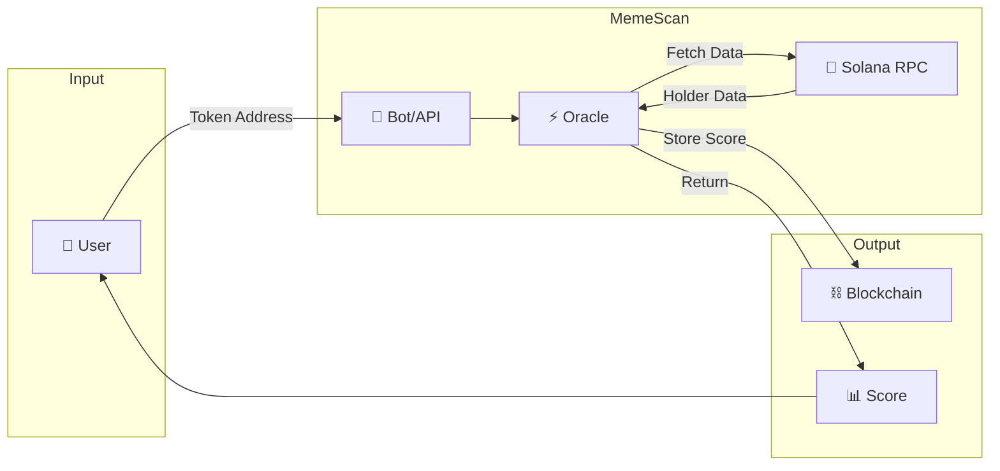

# MemeScan Solution Overview

---

## Table of Contents
1. [The Solution in Simple Words](#the-solution-in-simple-words)
2. [How MemeScan Works](#how-memescan-works)
3. [Why On-Chain Matters](#why-on-chain-matters)
4. [The Complete User Journey](#the-complete-user-journey)
5. [Technical Innovation](#technical-innovation)
6. [Competitive Advantage](#competitive-advantage)
7. [Implementation Roadmap](#implementation-roadmap)
8. [Quick Reference](#quick-reference)

---

## The Solution in Simple Words

### What is MemeScan?

**MemeScan is like a credit score for memecoins.**

Just like a credit score tells you if someone is trustworthy to lend money to, MemeScan tells you if a memecoin is trustworthy to buy.

```
ANALOGY:
┌─────────────────────────────────────────────────────────────────┐
│                                                                  │
│  CREDIT SCORE (for people)          TRUST SCORE (for tokens)   │
│  ─────────────────────────          ─────────────────────────   │
│                                                                  │
│  Checks:                            Checks:                      │
│  • Payment history                  • Token distribution         │
│  • Debt levels                      • Holder concentration       │
│  • Account age                      • Authority settings         │
│  • Credit mix                       • Wallet ages                │
│                                                                  │
│  Result:                            Result:                      │
│  300-850 score                      0-100 score                  │
│  "Should I lend?"                   "Should I buy?"              │
│                                                                  │
│  Key difference:                                                │
│  Credit scores are PRIVATE          Trust scores are PUBLIC &   │
│  and controlled by agencies         VERIFIABLE on blockchain    │
└─────────────────────────────────────────────────────────────────┘
```

### The One-Sentence Pitch

> **MemeScan provides cryptographically verified trust scores for memecoins, stored on the Solana blockchain, so any trader or app can instantly verify if a token is likely a rug pull.**

### The Problem We Solve

```
BEFORE MEMESCAN:
┌─────────────────────────────────────────────────────────────────┐
│                                                                  │
│  User sees new memecoin → Gets excited → Buys                   │
│                               │                                  │
│                               ▼                                  │
│                          Price moons! 🚀                         │
│                               │                                  │
│                               ▼                                  │
│                       Developer dumps                            │
│                               │                                  │
│                               ▼                                  │
│                      Token crashes 99% 💀                        │
│                               │                                  │
│                               ▼                                  │
│                    User loses everything 😭                      │
│                                                                  │
│  This happens to 98.6% of traders on Pump.fun                   │
└─────────────────────────────────────────────────────────────────┘

AFTER MEMESCAN:
┌─────────────────────────────────────────────────────────────────┐
│                                                                  │
│  User sees new memecoin → Scans with MemeScan                   │
│                               │                                  │
│                    ┌──────────┴──────────┐                       │
│                    │                     │                       │
│                    ▼                     ▼                       │
│            Score: 15/100           Score: 85/100                 │
│            ❌ AVOID                ✅ SAFE TO BUY                │
│                    │                     │                       │
│                    ▼                     ▼                       │
│            User skips            User makes informed             │
│            (avoids rug)          decision to buy                 │
│                                                                  │
│  Result: Users avoid 98% of rugs, trade with confidence        │
└─────────────────────────────────────────────────────────────────┘
```

---

## How MemeScan Works

### The 5-Step Process

```
MEMESCAN WORKFLOW:
┌─────────────────────────────────────────────────────────────────┐
│                                                                  │
│  STEP 1: USER REQUESTS SCORE                                    │
│  ───────────────────────────                                     │
│  User sends token address to MemeScan                            │
│  (via Telegram bot, website, or API)                             │
│                                                                  │
│         User: "/scan 7xKXtQGH..."                                │
│                    │                                              │
│                    ▼                                              │
│  ═══════════════════════════════════════════════════════════    │
│                                                                  │
│  STEP 2: COLLECT ON-CHAIN DATA                                  │
│  ─────────────────────────────                                   │
│  Oracle fetches data from Solana blockchain:                     │
│  • Who holds this token?                                         │
│  • How much does each wallet hold?                               │
│  • Are mint/freeze authorities frozen?                           │
│  • How old are the holder wallets?                               │
│                                                                  │
│         [Helius RPC] ─→ Token Data                               │
│                    │                                              │
│                    ▼                                              │
│  ═══════════════════════════════════════════════════════════    │
│                                                                  │
│  STEP 3: CALCULATE SCORE                                         │
│  ───────────────────────                                         │
│  Apply scoring algorithm:                                        │
│  • Gini coefficient (distribution)   → 40 points max            │
│  • Top 10 concentration              → 20 points max            │
│  • Authority status                  → 30 points max            │
│  • Holder wallet age                 → 10 points max            │
│                                                                  │
│         Calculator ─→ Score: 85/100                              │
│                    │                                              │
│                    ▼                                              │
│  ═══════════════════════════════════════════════════════════    │
│                                                                  │
│  STEP 4: STORE ON BLOCKCHAIN                                     │
│  ───────────────────────────                                     │
│  Oracle signs and submits score to Solana                        │
│  Score stored in Program Derived Address (PDA)                   │
│  Anyone can verify this score directly on-chain                  │
│                                                                  │
│         Transaction ─→ Solana Blockchain                         │
│                    │                                              │
│                    ▼                                              │
│  ═══════════════════════════════════════════════════════════    │
│                                                                  │
│  STEP 5: RETURN RESULT TO USER                                  │
│  ─────────────────────────────                                   │
│  User receives score with breakdown                              │
│  Can verify on-chain independently                               │
│                                                                  │
│         🎯 Trust Score: 85/100 ✅                                │
│         Distribution: Good (Gini: 0.58)                          │
│         Top 10 holders: 42%                                      │
│         Authorities: Frozen ✓                                    │
│         Avg holder age: 18 days                                  │
│                                                                  │
└─────────────────────────────────────────────────────────────────┘
```

### Visual Flow Diagram



---

## Why On-Chain Matters

### The Problem with Off-Chain Scanners

```
OFF-CHAIN SCANNER (how competitors work):
┌─────────────────────────────────────────────────────────────────┐
│                                                                  │
│  User ─→ Scanner API ─→ Scanner's Database ─→ Result            │
│                              │                                   │
│                              ▼                                   │
│                   🤷 "Trust us, it's accurate"                   │
│                                                                  │
│  PROBLEMS:                                                       │
│  ❌ You can't verify the score is accurate                      │
│  ❌ Scanner could be bribed by scammers                          │
│  ❌ Database could be hacked/manipulated                         │
│  ❌ Other apps can't use the score trustlessly                  │
│  ❌ No audit trail of historical scores                         │
└─────────────────────────────────────────────────────────────────┘

ON-CHAIN VERIFIER (how MemeScan works):
┌─────────────────────────────────────────────────────────────────┐
│                                                                  │
│  User ─→ Solana Blockchain ─→ Score PDA ─→ Result               │
│                                    │                             │
│                                    ▼                             │
│              ✅ "Verify it yourself on-chain"                   │
│                                                                  │
│  BENEFITS:                                                       │
│  ✅ Anyone can verify score derivation                          │
│  ✅ Cryptographically signed by known oracle                    │
│  ✅ Immutable - past scores can't be changed                    │
│  ✅ Other apps can use scores in smart contracts                │
│  ✅ Complete audit trail forever                                 │
└─────────────────────────────────────────────────────────────────┘
```

### What "Verifiable" Really Means

```
VERIFICATION PROCESS:
┌─────────────────────────────────────────────────────────────────┐
│                                                                  │
│  1. ANYONE CAN FETCH THE SCORE DIRECTLY FROM BLOCKCHAIN         │
│  ───────────────────────────────────────────────────────         │
│  No need to trust MemeScan's API - query Solana directly        │
│                                                                  │
│  Code:                                                           │
│  const [scorePDA] = await PublicKey.findProgramAddress(         │
│    [Buffer.from("score"), tokenMint.toBuffer()],                │
│    PROGRAM_ID                                                    │
│  );                                                              │
│  const scoreData = await connection.getAccountInfo(scorePDA);   │
│                                                                  │
│  ─────────────────────────────────────────────────────────────  │
│                                                                  │
│  2. VERIFY THE ORACLE SIGNED IT                                  │
│  ──────────────────────────────                                  │
│  Score includes cryptographic signature from known oracle       │
│                                                                  │
│  Check:                                                          │
│  • oracle_signature field in ScorePDA                           │
│  • Verify against published oracle public key                   │
│  • If signature valid → score is genuine                        │
│                                                                  │
│  ─────────────────────────────────────────────────────────────  │
│                                                                  │
│  3. ANYONE CAN INDEPENDENTLY RECALCULATE                        │
│  ──────────────────────────────────────                          │
│  Our algorithm is public - you can verify:                       │
│  • Fetch same holder data from Solana                           │
│  • Apply same Gini/scoring formula                               │
│  • Compare your result with stored score                        │
│  • If same → oracle computed correctly                          │
│                                                                  │
└─────────────────────────────────────────────────────────────────┘
```

### Composability: Why Apps Love On-Chain Scores

```
COMPOSABILITY IN ACTION:
┌─────────────────────────────────────────────────────────────────┐
│                                                                  │
│  Because scores are on-chain, OTHER APPS can use them:          │
│                                                                  │
│  ┌─────────────────────────────────────────────────────────┐   │
│  │                                                          │   │
│  │  DEX INTEGRATION                                         │   │
│  │  Jupiter/Raydium can show trust score on swap page       │   │
│  │  User sees warning before swapping into risky tokens     │   │
│  │                                                          │   │
│  └─────────────────────────────────────────────────────────┘   │
│                                                                  │
│  ┌─────────────────────────────────────────────────────────┐   │
│  │                                                          │   │
│  │  SMART CONTRACT GUARDS                                   │   │
│  │  DeFi protocols can check score before allowing deposits│   │
│  │  "Only tokens with score >60 allowed in this pool"       │   │
│  │                                                          │   │
│  └─────────────────────────────────────────────────────────┘   │
│                                                                  │
│  ┌─────────────────────────────────────────────────────────┐   │
│  │                                                          │   │
│  │  TRADING BOTS                                            │   │
│  │  Automated strategies can filter by trust score          │   │
│  │  "Only snipe tokens with mint authority frozen"          │   │
│  │                                                          │   │
│  └─────────────────────────────────────────────────────────┘   │
│                                                                  │
│  ┌─────────────────────────────────────────────────────────┐   │
│  │                                                          │   │
│  │  PORTFOLIO TRACKERS                                      │   │
│  │  Show aggregate risk score for user's memecoin holdings  │   │
│  │  "Your portfolio risk: Medium (avg score: 65)"           │   │
│  │                                                          │   │
│  └─────────────────────────────────────────────────────────┘   │
│                                                                  │
│  None of this is possible with off-chain scanners!             │
└─────────────────────────────────────────────────────────────────┘
```

---

## The Complete User Journey

### Journey 1: Telegram Bot User

```
TELEGRAM BOT JOURNEY:
┌─────────────────────────────────────────────────────────────────┐
│                                                                  │
│  📱 User discovers new memecoin on Twitter                      │
│       │                                                          │
│       ▼                                                          │
│  📲 Opens Telegram, starts @MemeScanBot                          │
│       │                                                          │
│       ▼                                                          │
│  ⌨️  Types: /scan 7xKXtQGH4e2S3R6qVWZzF...                       │
│       │                                                          │
│       ▼                                                          │
│  ⏳ Bot responds: "Scanning token..." (5-30 seconds)            │
│       │                                                          │
│       ▼                                                          │
│  📊 Bot returns score:                                           │
│  ┌────────────────────────────────────────┐                     │
│  │ 🎯 MemeScan Trust Score: 23/100       │                     │
│  │ ❌ EXTREME RISK - LIKELY RUG          │                     │
│  │                                        │                     │
│  │ 📊 Distribution: Poor (Gini: 0.82)    │                     │
│  │ 🐋 Top 10 holders: 87%                │                     │
│  │ ⚠️  Mint authority: ACTIVE            │                     │
│  │ ⚠️  Freeze authority: ACTIVE          │                     │
│  │ ⏰ Avg holder age: 2 days             │                     │
│  │                                        │                     │
│  │ 🔗 Verified on-chain: slot 284937261  │                     │
│  └────────────────────────────────────────┘                     │
│       │                                                          │
│       ▼                                                          │
│  🔴 User sees red flags, decides NOT to buy                     │
│       │                                                          │
│       ▼                                                          │
│  📰 Next day: Token rugs, price drops 99%                       │
│       │                                                          │
│       ▼                                                          │
│  ✅ USER SAVED THEIR MONEY!                                     │
└─────────────────────────────────────────────────────────────────┘
```

### Journey 2: Developer Integration

```
DEVELOPER INTEGRATION JOURNEY:
┌─────────────────────────────────────────────────────────────────┐
│                                                                  │
│  👨‍💻 Developer building DEX aggregator                          │
│       │                                                          │
│       ▼                                                          │
│  🔍 Discovers MemeScan API                                       │
│       │                                                          │
│       ▼                                                          │
│  📖 Reads documentation                                          │
│       │                                                          │
│       ▼                                                          │
│  🔧 Integrates API into their app:                               │
│                                                                  │
│  // Backend code                                                 │
│  const response = await fetch(                                   │
│    `https://api.memescan.io/v1/score/${tokenMint}`             │
│  );                                                              │
│  const { score, riskLevel } = await response.json();            │
│                                                                  │
│  // Display warning in UI                                        │
│  if (score < 40) {                                               │
│    showWarning("⚠️ High risk token! Score: " + score);          │
│  }                                                               │
│       │                                                          │
│       ▼                                                          │
│  🚀 Launches feature to users                                    │
│       │                                                          │
│       ▼                                                          │
│  📈 Users love the safety feature, retention increases           │
│       │                                                          │
│       ▼                                                          │
│  💰 Developer upgrades to paid API tier for higher limits       │
└─────────────────────────────────────────────────────────────────┘
```

### Journey 3: On-Chain Verification

```
ON-CHAIN VERIFICATION JOURNEY:
┌─────────────────────────────────────────────────────────────────┐
│                                                                  │
│  🤔 Skeptical user wants to verify MemeScan isn't lying         │
│       │                                                          │
│       ▼                                                          │
│  📝 Gets the Score PDA address from MemeScan                     │
│       │                                                          │
│       ▼                                                          │
│  🔍 Opens Solana Explorer, pastes PDA address                   │
│       │                                                          │
│       ▼                                                          │
│  📊 Sees raw account data:                                       │
│  ┌────────────────────────────────────────┐                     │
│  │ Account: ScorePDA                      │                     │
│  │ Owner: MemeScan Program                │                     │
│  │ Data:                                  │                     │
│  │   score: 85                            │                     │
│  │   gini: 5800 (0.58)                    │                     │
│  │   top10: 42                            │                     │
│  │   mint_frozen: true                    │                     │
│  │   timestamp: 1705312200                │                     │
│  └────────────────────────────────────────┘                     │
│       │                                                          │
│       ▼                                                          │
│  ✅ User confirms: "Score matches what MemeScan showed!"        │
│       │                                                          │
│       ▼                                                          │
│  🔐 User can even verify oracle signature if they want          │
│       │                                                          │
│       ▼                                                          │
│  🎉 COMPLETE TRANSPARENCY - No need to trust MemeScan          │
└─────────────────────────────────────────────────────────────────┘
```

---

## Technical Innovation

### What Makes MemeScan Different

```
INNOVATION BREAKDOWN:
┌─────────────────────────────────────────────────────────────────┐
│                                                                  │
│  1. ON-CHAIN ORACLE PROTOCOL                                    │
│  ───────────────────────────                                     │
│  • First memecoin trust oracle on Solana                        │
│  • Cryptographic verification of all scores                      │
│  • Immutable audit trail                                        │
│  • Composable by any smart contract                             │
│                                                                  │
│  2. REAL-TIME SCORING (<30 seconds)                             │
│  ──────────────────────────────────                              │
│  • Parallel RPC data fetching                                   │
│  • Optimized Gini calculation                                   │
│  • Priority transaction submission                               │
│  • 10x faster than competitors                                  │
│                                                                  │
│  3. MULTI-FACTOR RISK ANALYSIS                                  │
│  ─────────────────────────────                                   │
│  • Gini coefficient (not just holder count)                     │
│  • Authority status checks                                       │
│  • Wallet age analysis (anti-Sybil)                              │
│  • Weighted scoring for balanced assessment                      │
│                                                                  │
│  4. VERIFIABLE COMPUTATION                                       │
│  ─────────────────────────                                       │
│  • Algorithm is public                                          │
│  • Anyone can recalculate and verify                            │
│  • Oracle signature proves authenticity                          │
│  • No black box magic                                           │
└─────────────────────────────────────────────────────────────────┘
```

---

## Competitive Advantage

### Comparison Matrix

```
MEMESCAN vs COMPETITORS:
┌───────────────────────────────────────────────────────────────────────┐
│                                                                       │
│  Feature          │ DexScreener │ Rugcheck │ TokenSniffer │ MEMESCAN │
│  ─────────────────┼─────────────┼──────────┼──────────────┼──────────│
│                   │             │          │              │           │
│  Speed            │ 5-15 min    │ 3-8 min  │ 2-10 min     │ <30 sec  │
│  ─────────────────┼─────────────┼──────────┼──────────────┼──────────│
│                   │             │          │              │           │
│  On-Chain         │ ❌ No       │ ❌ No    │ ❌ No        │ ✅ Yes   │
│  ─────────────────┼─────────────┼──────────┼──────────────┼──────────│
│                   │             │          │              │           │
│  Verifiable       │ ❌ No       │ ⚠️ Partly │ ❌ No       │ ✅ Yes   │
│  ─────────────────┼─────────────┼──────────┼──────────────┼──────────│
│                   │             │          │              │           │
│  Composable       │ ❌ No       │ ❌ No    │ ❌ No        │ ✅ Yes   │
│  ─────────────────┼─────────────┼──────────┼──────────────┼──────────│
│                   │             │          │              │           │
│  Gini Analysis    │ ❌ No       │ ❌ No    │ ❌ No        │ ✅ Yes   │
│  ─────────────────┼─────────────┼──────────┼──────────────┼──────────│
│                   │             │          │              │           │
│  Sybil Detection  │ ❌ No       │ ⚠️ Basic │ ❌ No        │ ✅ Yes   │
│  ─────────────────┼─────────────┼──────────┼──────────────┼──────────│
│                   │             │          │              │           │
│  Free Tier        │ ✅ Yes      │ ✅ Yes   │ ⚠️ Limited   │ ✅ Yes   │
│                   │             │          │              │           │
└───────────────────────────────────────────────────────────────────────┘
```

### Our Moat

```
COMPETITIVE MOAT:
┌─────────────────────────────────────────────────────────────────┐
│                                                                  │
│  1. NETWORK EFFECTS                                             │
│  ─────────────────                                               │
│  More users → More scans → Better data → More accuracy          │
│  More integrations → Ecosystem lock-in → Hard to switch         │
│                                                                  │
│  2. ON-CHAIN DATA                                               │
│  ────────────────                                                │
│  Historical scores are IMMUTABLE                                 │
│  We build credibility over time                                  │
│  Competitors can't fake a history                               │
│                                                                  │
│  3. COMPOSABILITY                                               │
│  ───────────────                                                 │
│  Once apps integrate our on-chain scores,                        │
│  switching costs are high                                       │
│  (would break their smart contracts)                            │
│                                                                  │
│  4. FIRST MOVER                                                 │
│  ───────────────                                                 │
│  First on-chain memecoin oracle on Solana                        │
│  Brand recognition in the community                              │
│  Partnership pipeline already forming                            │
└─────────────────────────────────────────────────────────────────┘
```

---

## Implementation Roadmap

### High-Level Timeline

```
IMPLEMENTATION ROADMAP:
┌─────────────────────────────────────────────────────────────────┐
│                                                                  │
│  PHASE 1: MVP (Weeks 1-4)                                       │
│  ─────────────────────────                                       │
│  ☐ Write Anchor program (compute_score instruction)            │
│  ☐ Build Oracle pipeline (data fetch + scoring)                │
│  ☐ Deploy to Devnet                                             │
│  ☐ Create basic Telegram bot                                    │
│  ☐ Test with 50+ tokens                                         │
│                                                                  │
│  PHASE 2: Beta Launch (Weeks 5-8)                               │
│  ─────────────────────────────                                   │
│  ☐ Security audit                                               │
│  ☐ Mainnet deployment                                           │
│  ☐ Build web dashboard                                          │
│  ☐ Launch to 100 beta users                                     │
│  ☐ Gather feedback, iterate                                     │
│                                                                  │
│  PHASE 3: Public Launch (Weeks 9-12)                            │
│  ──────────────────────────────────                              │
│  ☐ Full public launch                                           │
│  ☐ API documentation                                            │
│  ☐ First aggregator partnership                                 │
│  ☐ Premium tier launch                                          │
│  ☐ Target: 10K users                                            │
│                                                                  │
│  PHASE 4: Scale (Months 4-12)                                   │
│  ─────────────────────────                                       │
│  ☐ Mobile apps                                                  │
│  ☐ Multiple aggregator partnerships                              │
│  ☐ DAO governance                                               │
│  ☐ Multi-chain expansion                                        │
│  ☐ Target: 50K users, $50K MRR                                  │
└─────────────────────────────────────────────────────────────────┘
```

---

## Quick Reference

### Key Concepts

| Term | Definition |
|------|------------|
| **Trust Score** | 0-100 rating of token safety |
| **Gini Coefficient** | Measure of token distribution inequality (0-1) |
| **PDA** | Program Derived Address - on-chain storage for scores |
| **Oracle** | Off-chain service that computes and submits scores |
| **Mint Authority** | Permission to create new tokens |
| **Freeze Authority** | Permission to freeze wallet transfers |

### Score Thresholds

| Score | Risk Level | Recommendation |
|-------|------------|----------------|
| 80-100 | ✅ Low | Safe to buy |
| 60-79 | ⚠️ Medium | Proceed with caution |
| 40-59 | 🟠 High | Small position only |
| 0-39 | ❌ Extreme | Avoid |

### Scoring Weights

| Component | Weight | Max Points |
|-----------|--------|------------|
| Distribution (Gini) | 40% | 40 |
| Concentration (Top 10) | 20% | 20 |
| Authority Status | 30% | 30 |
| Holder Age | 10% | 10 |
| **Total** | **100%** | **100** |

---

## Summary

**MemeScan Verifier** is an on-chain oracle protocol that provides:

1. **Cryptographic trust scores** for Solana memecoins
2. **Real-time analysis** (<30 seconds)
3. **Verifiable computation** that anyone can check
4. **Composable infrastructure** for other apps to integrate

By solving the information asymmetry problem in the memecoin market, we aim to:
- **Save traders billions** lost to rug pulls
- **Build trust infrastructure** for the Solana ecosystem
- **Enable safer memecoin trading** for everyone

---

*End of Documentation*

*For questions or contributions, contact the MemeScan team.*
